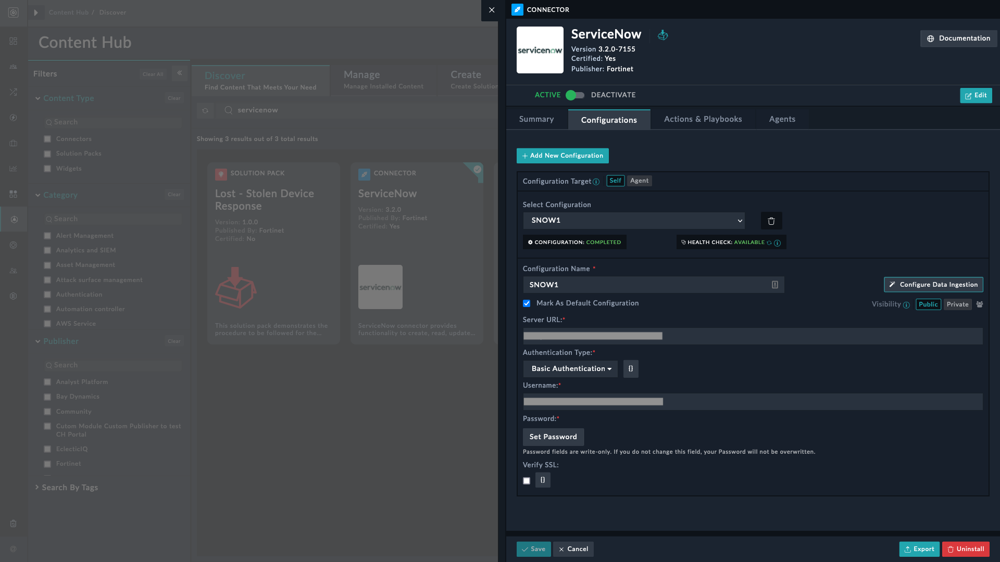
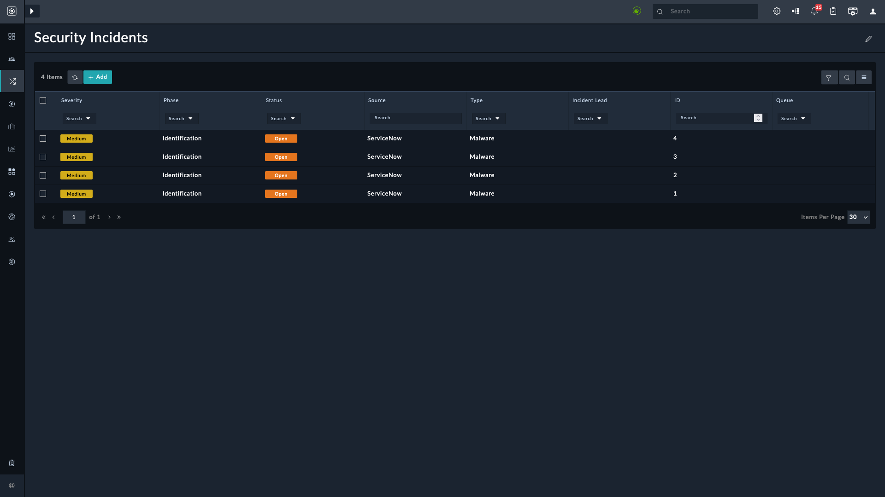

| [Home](https://github.com/fortinet-fortisoar/solution-pack-servicenow-security-incident-response-integration/blob/release/1.0.0/README.md) | 
|--------------------------------------------|

# Usage

To begin using this solution pack, ensure that the ServiceNow connector is configured and its data ingestion is correctly setup.

You can schedule data ingestion at regular intervals. For more information on configuring this connector and scheduling data ingestion refer to [Data Ingestion Wizard](https://docs.fortinet.com/document/fortisoar/3.2.0/servicenow/384/servicenow-v3-2-0#Configure_Data_Ingestion).

After you trigger data ingestion, navigate to **Incident Response** > **Security Incidents** to view all security incidents ingested in FortiSOAR.

Click to open any of the displayed incidents and observe the following among other information about the incident:

- Status
- Severity
- Phase
- Type
